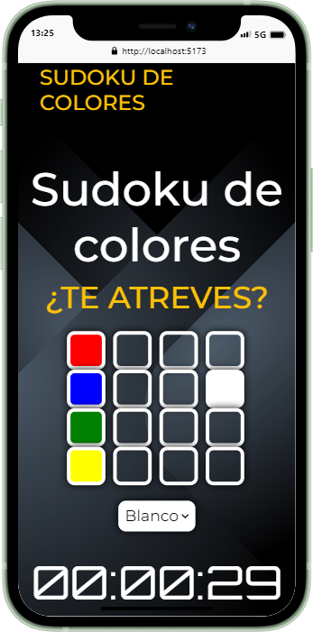
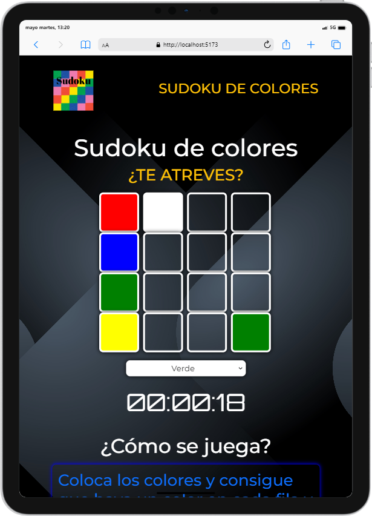

<h1 align="center" style="color: #0366d6;">
   Juego de Sudoku de colores 📱 💻 🖥
</h1>

El código proporcionado es un juego de Sudoku de colores en el que el jugador debe completar un tablero de 4x4 con colores fijos en ciertas celdas. El juego consta de varios niveles, cada uno con una combinación diferente de colores fijos. El objetivo es completar el tablero siguiendo las reglas del Sudoku, donde cada fila y columna debe contener cada color una sola vez.

El código incluye funciones para crear el tablero, añadir colores fijos, permitir al jugador seleccionar y cambiar colores en las celdas, verificar si el tablero está completo y mostrar mensajes de victoria o derrota. También se incluyen funciones para controlar el tiempo transcurrido, reiniciar el temporizador y formatear el tiempo en formato HH:MM:SS.

El juego se inicia al cargar completamente el DOM y el jugador avanza de nivel al completar correctamente el tablero. Si se completa el último nivel, se muestra un mensaje de felicitación y se reinicia el juego.

En resumen, el código proporciona una implementación de un juego de Sudoku de colores interactivo que desafía al jugador a completar el tablero dentro de los límites de tiempo y las reglas del juego, utilizando SASS y Bootstrap para estilizar y estructurar la interfaz del juego, con la ventaja de ser accesible en cualquier dispositivo.

## Vista previa 🖼️

### Móvil 📱

  

### Tablet 📱💻

  

     
   

## Uso 📋

Este proyecto requiere el uso de Vite para su correcto funcionamiento. Asegúrate de tener Vite instalado en tu entorno de desarrollo antes de continuar. 
 
## Pasos para utilizar el proyecto: 
 
1. Descarga e instala Vite en tu sistema si aún no lo has hecho. 
2. Descarga las dependencias del proyecto utilizando el comando  npm install  o  yarn install . 
3. Una vez que todas las dependencias se hayan descargado correctamente, puedes arrancar el proyecto utilizando el comando  npm run dev  o  yarn dev . 
 
¡Listo! Ahora deberías poder utilizar el proyecto sin problemas. ¡Gracias por utilizar la aplicación!

## Contribuciones 🤝

¡Las contribuciones son bienvenidas! Si encuentras problemas, tienes ideas para mejoras o deseas agregar nuevas características, por favor abre un problema o una solicitud de extracción.

## Trabajo Freelance 💼

Estoy disponible para trabajar en proyectos de diseño web, ya sea para particulares o empresas. Si necesitas ayuda con el diseño de tu sitio web o tienes algún proyecto en mente, ¡no dudes en contactarme en 
 
[@BarrioCort7876](https://www.twitter.com/BarrioCort7876) 

## Licencia 📜

Este proyecto está bajo la licencia [MIT] - Consulta el archivo [LICENSE](LICENSE) para más detalles.

